  

# Wikimedia Deutschland x The Data Mine

This repository contains the program materials and student work for Wikimedia Deutschland's project in the [2024 Purdue Data Mine](https://datamine.purdue.edu/). Students will focus on comparing data from [Wikidata](https://www.wikidata.org/) with external data sources and then derive and report mismatches for the [Wikidata Mismatch Finder](https://www.wikidata.org/wiki/Wikidata:Mismatch_Finder). The corrections of these mismatches by the Wikidata community will then serve to improve Wikidata's data and all downstream projects including [Wikipedia](https://www.wikipedia.org/).

## **Contents**

- [MismatchGeneration](https://github.com/Wikidata/Purdue-Data-Mine-2024/tree/main/MismatchGeneration)
  - Student work to derive mismatches between Wikidata and external sources
- [Notebooks](https://github.com/Wikidata/Purdue-Data-Mine-2024/tree/main/Notebooks)
  - Program materials to introduce Python, Jupyter, Wikidata data access and more

## Process

Below is a flowchart describing the process used to generate mismatches.

```mermaid
flowchart TD
 subgraph Verify
    direction TB
        D("For example, if our chosen database is MusicBrainz,
           we would search for “P:MusicBrainz and find properties
           like “MusicBrainz release group ID (P436)” that links
           a Wikidata album to a MusicBrainz album")
        C("We can search for an external ID
           property by typing P:
           in the Search on the Wikidata website")
        B("Verify that external identifiers
           properties that link Wikidata items
           with the database exist in Wikidata")
  end
 subgraph Items
    direction TB
        F("Run a query on <a href="https://query.wikidata.org/">query.wikidata.org</a>
           counting how many items have the
           external ID property found")
        E("Verify that a lot of Wikidata items
           are linked to that database (we want
           our code to be useful for a lot of entries)")
  end
 subgraph 1
    direction LR
        Verify
        Items
        A("Choose a database that has
        links to Wikidata to compare
        information against")
  end
 subgraph Research
    direction TB
        search("Search 'DatabaseName API' in a search engine")
        research1("Research if it has an API endpoint
                   (a URL we can use to access data)")
        public("Make sure the API is publicly
                accessible (not paid)")
        unofficial("The API may be an “unofficial API”
                   where somebody has scrapped the data
                   or used an alternative method to get
                   data from a website

                   Verify this API is up-to-date in
                   information, still works, and something
                   that can be queried at scale")
  end
 subgraph 2
    direction LR
        find("Find a way to access the
              database's data so we can
              compare it with Wikidata's")
        Research
        ifAPI("Research if there is a dump
               that will allow us to download
               the entire database at once and not
                make so many REST requests")
        ifNoAPI("Look into using a Python library
                 that can do web scraping
                 like Beautiful Soup")
  end
 subgraph Decide
    direction TB
        mb["Ex: MusicBrainz stores artist data,
            so we could decide to compare
            artist data in Wikidata with artist
            data in MusicBrainz"]
        decide1("Decide which data type to compare
                 and find mismatches for")
  end
 subgraph Attribute
    direction TB
        ex["Ex: MusicBrainz stores the founding
            date of an artist and Wikidata does
            as well using “debut date” (P10673)"]
        att("Find which attribute of
             the data type to compare")
  end
 subgraph 3
    direction LR
        Decide
        Attribute
  end
 subgraph Test
    direction TB
        write["Write python code to get that
               data using the requests library
               for URLs or another method"]
        find2["Find the ID of an entity
               in that database and then plug
               it into a URL for the API
               or query for it in a dump"]
        test1("Test out getting one item from
               the database first to
               know how to get many")
  end
 subgraph Compare
    direction TB
        comp1("The returned object from the API
               might be in a Python dict or
               list so use dict[“key”] to get to it")
        comp("Write the code to get the data
              from the decided attribute to
              compare with Wikidata")
  end
 subgraph 4
    direction LR
        method("Get the data from the
                database using the method
                chosen above")
        Test
        Compare
  end
 subgraph QIDs
    direction TB
        mb2["With the MusicBrainz example,
             we would be filtering for items that
             have “MusicBrainz artist ID (P434)”
             and “debut date” (P10673)”"]
        dir["In other words, find which items have the:
             1. External identifier property researched earlier
             that link the Wikidata item to the database
             2. The attribute property decided on

Execute a SPARQL query on the
Wikidata Query Service or QLever to do this"]
        list("Get the list of item IDs (QIDs)
              from Wikidata that are linked to
              the database and have the property
              for the attribute we are looking
              to generate mismatches for")
  end
 subgraph 5
    direction LR
        get("Get the Wikidata items that
             are linked to the database
             and their data to compare
             with the database’s data")
        QIDs
        filter("Filter the Wikidata dump
                for these items with these
                IDs using Python")
  end
 subgraph Iterate
    direction TB
        iterate2("In each iteration:
                  1. Get the ID of entity in the external database from the Wikidata item
                  2. Use the ID and the code from before to make a query to the API or
                  dump to get the entity's data in that database
                  3. Use the code from before to get the attribute from that database and
                  compare it with the value in Wikidata
                  4. If they the values are not equivalent add the relevant information
                  about the mismatch to a mismatch dataframe with the needed format (<a href="https://github.com/wmde/wikidata-mismatch-finder/blob/main/docs/UserGuide.md#creating-a-mismatches-import-file">link</a>)")
        iterate("Write Python code to iterate through
                 each of the filtered Wikidata items
                 and find if the Wikidata item attribute
                 matches with that from the other database")
  end
 subgraph 6
    direction LR
        compare2("Get and compare the data
                  in the external database
                  with that from Wikidata")
        Iterate
        mis("Use the Mismatch Finder validator from
             utils.py in this repo to validate that
             your mismatch dataframe is correct")
  end
 subgraph 7
    direction LR
        convert("Convert the the mismatch dataframe to a CSV

                  Make sure to export it without an index column
                  in pandas and <a href="https://github.com/wmde/wikidata-mismatch-finder/blob/main/docs/UserGuide. md#getting-upload-rights">upload it to the Mismatch Finder</a>")
                  upload("Upload the mismatches")
  end
    B --> C
    C --> D
    E --> F
    A --> Verify
    Verify ---> Items
    research1 --> search
    search --> public & unofficial
    find --> Research
    Research -- API --> ifAPI
    Research -- no API --> ifNoAPI
    decide1 --> mb
    att --> ex
    Decide --> Attribute
    test1 --> find2
    find2 --> write
    comp --> comp1
    method --> Test
    Test --> Compare
    list --> dir
    dir --> mb2
    get --> QIDs
    QIDs --> filter
    iterate --> iterate2
    compare2 --> Iterate
    Iterate --> mis
    upload --> convert
    1 --> 2
    2 --> 3
    3 --> 4
    4 --> 5
    5 --> 6
    6 --> 7
```

